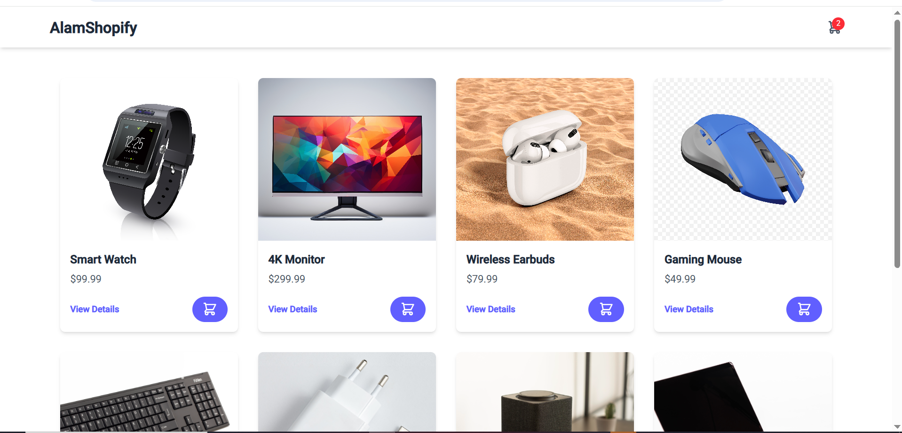
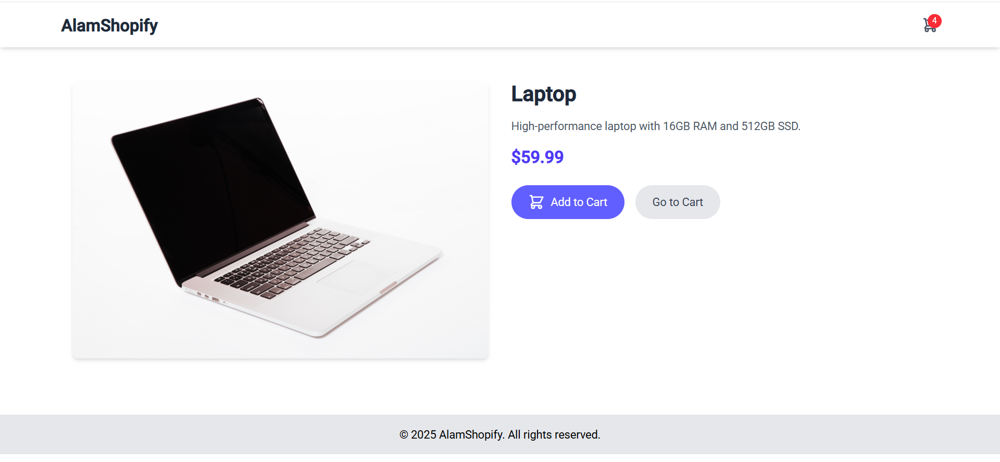
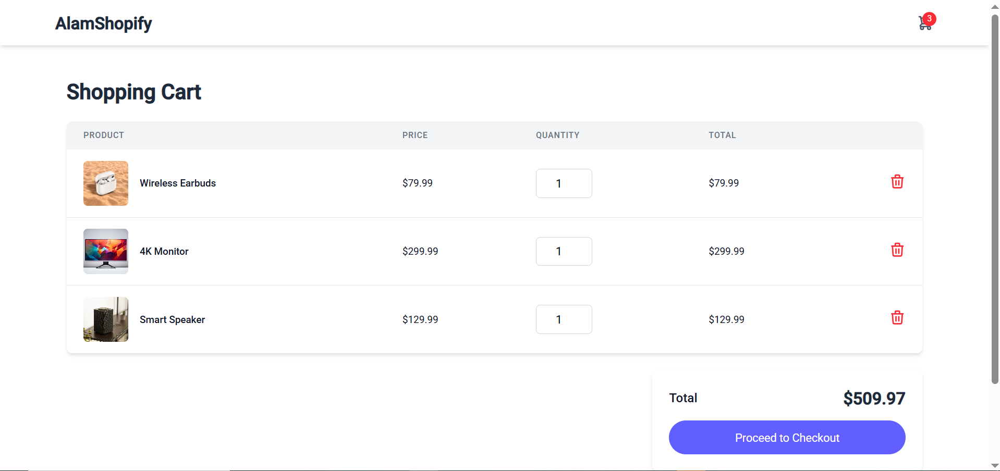

# MiniCommerce

## Overview
This is a AlamShopify a mini-commerce application built with Angular. It allows users to browse products, add them to the cart, and run a mock checkout.

## Screenshots

**Landing Page**

**Product Detail Page**

**Cart Page**

## Design Approach
- **Layout**: A responsive grid-based layout that adapts to different screen sizes.
- **Colors**: A modern and clean color palette to provide a good user experience.
- **Responsiveness**: The application is fully responsive and works on mobile, tablet, and desktop devices.

## Tools & Techniques
- **Framework**: [Angular](https://angular.io/)
- **Styling**: [Tailwind CSS](https://tailwindcss.com/)
- **State Management**: Services with RxJS for managing application state.
- **Unit Testing**: [Karma](https://karma-runner.github.io) and [Jasmine](https://jasmine.github.io/) for unit tests.
- **End-to-End Testing**: No E2E tests are set up for this project.

## SEO Strategy
- **Meta Tags**: Dynamic meta tags for product pages to improve search engine visibility.
- **Performance**: Optimized for fast loading times with lazy loading of modules and optimized images.

## Error-handling Technique
- **Logging**: Errors are logged to the console during development.
- **User Feedback**: User-friendly error messages are displayed for network errors or other issues.

## tsconfig config
This project uses strict TypeScript settings to ensure code quality and maintainability. You can find the configuration in the following file:
- [`tsconfig.json`](./tsconfig.json)

---

This project was generated using [Angular CLI](https://github.com/angular/angular-cli) version 19.2.4.

